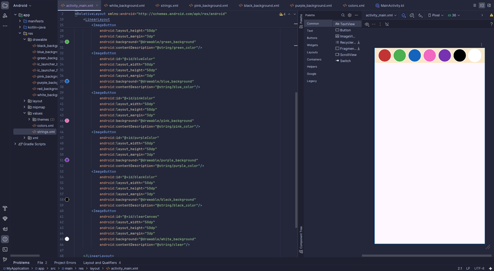
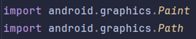
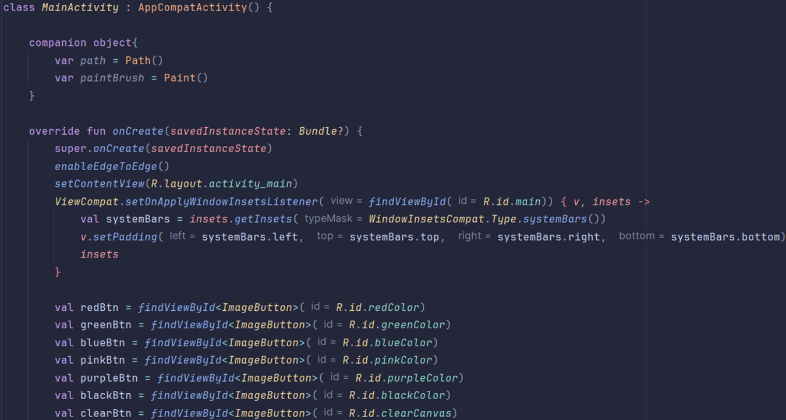
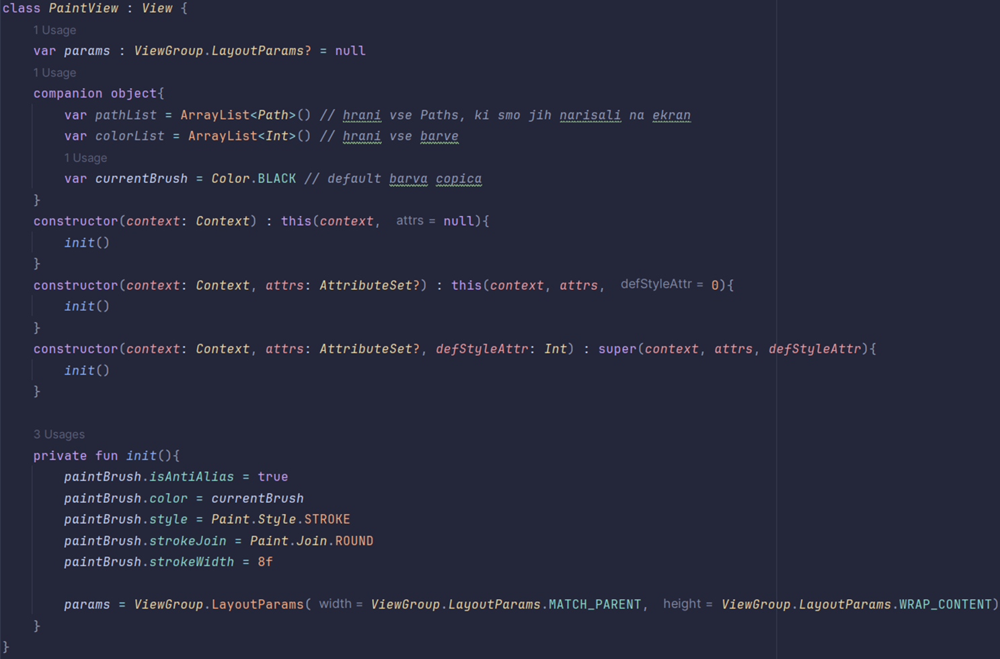
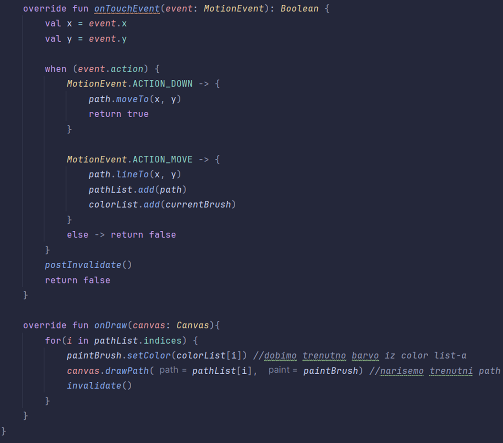
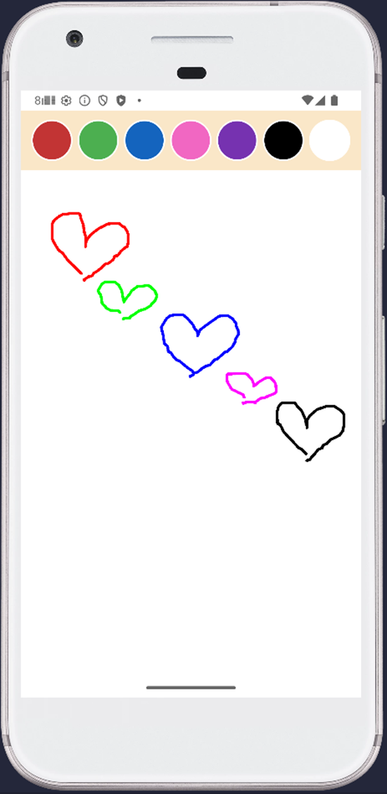
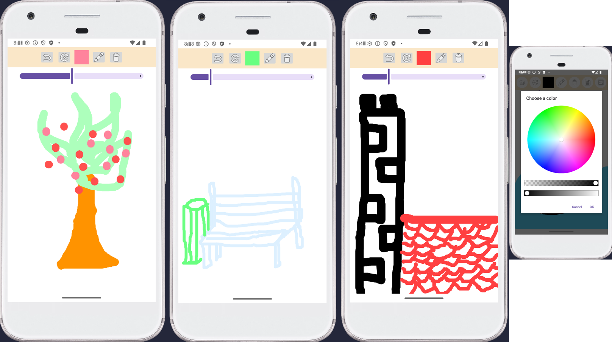
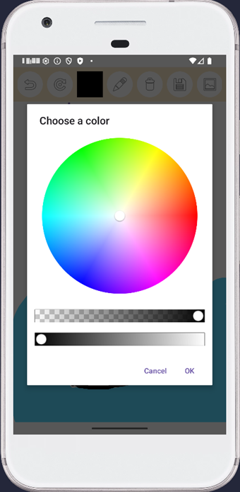
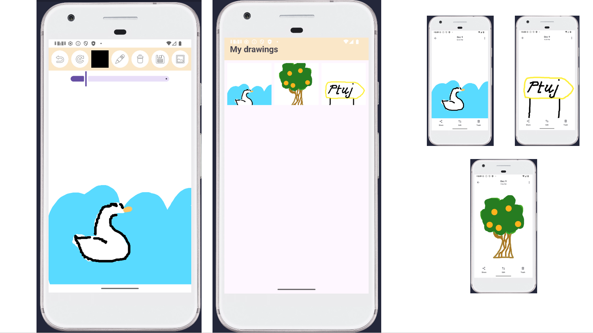

# Paint App
## Risanje s prstom
## prikaz uporabe s Paint in Canvas ter implementacija s knjižnicama DrawingCanvas in ColorPickerView

## Motivacija za projekt
Druga aplikacija pri vajah Platformno odvisen razvoj aplikacij (kjer mora biti zemljevid in push notiications)
- ime: Eye Spy
- ideja: uporabniki narišejo nekaj v aplikaciji, kar opazijo na kakšni lokaciji v resničnem življenju, risba se shrani na tisti lokaciji
- uporabnik je na določeni lokaciji, kjer je shranjen kakšen "I spy with my little eye" obveščen, da je nek uporabnik na tisti lokaciji narisal nek predmet
- uporabnik vidi risbo in skuša najti ta objekt v resničnem življenju na tisti lokaciji
- del te aplikacije mora biti torej RISANJE S PRSTOM

## OSNOVNA TEHNOLOGIJA: PAINT in CANVAS
https://developer.android.com/reference/kotlin/android/graphics/Paint
https://developer.android.com/reference/android/graphics/Canvas

- zelo obsežni orodji
- vgrajeni v Android Studio
- orodji za risanje po površini
- barva, debelina, stil črte... vse kar je možno za srednje kompleksne aplikacije risanja s prstom

CANVAS ... platno
PAINT ... čopič

Path...črte, ki so narisane na platnu
Bitmap... rabimo za ozadje

PREDNOSTI:
- brez dodatnih knjižnic, že integrirano v Android SDK
- zelo hitro in učinkovito
- velika fleksibilna, imamo popoln nadzor nad platnom (Canvas) in čopičem (Paint)

SLABOSTI:
- zelo dobro je treba poznati grafiko v Android Studio (uporaba Canvas transformacij in Path je zahtevna)
- ni vgrajenega UI za barve, čopiče, undo/redo... vse je treba ročno implementirati
- pri kompleksnejših risbah je težko programirati in optimizirati

LICENCA:
- Android Open Source Project (AOSP) -> Apache License 2.0

UPORABA:
- v skoraj vseh aplikacijah z vizualnim upodabljanjem stvari
- milijarde uporabnikov

ČASOVNA ZAHTEVNOST
- risanje črt: O(1) za posamezno potezo
- ob ponovnem izrisu View-a: O(n)... n=število Path elementov

PROSTORSKA ZAHTEVNOST
- shranjeni Path-i: O(n)
- Bitmap za ozadje: width x height x 4 bytes

VZDRŽEVANJE
- Google
- aktiven razvoj
- 15 let
- zadnje spremembe: 2023-24
- več sto razvijalcev

## Uporaba golega Paint in Canvas

Naredila sem za omejeno število barv - že tu veliko kode

V glavnem razredu sem uporabljala companion objekte, da sem lahko podala PaintView razredu (razredu, ki je strukturiral risbo)
Path in Paint instanci

V razredu PaintView sem potem mogla v njegovem companion objektu hraniti vse Paths, ki so bili narisani na ekran,
vse barve, ki so narisane na ekranu in trenutna barva čopiča
init inicializira čopič v konstruktorju

V PaintView:
- onTouchEvent: omogoči, da se stvari dogajajo med dotikanjem zaslona
- onDraw: noter damo Canvas, pridobimo trenutno barvo in nad njim kličemo drawPath, ker želimo izris poti risanja

--- 

vsak gumb za barvo ima onClickListener, ki nastavi drugo barvo čopiču

končni rezultat je aplikacija za risanje s prstom z omejenim številom barv

## UPORABA KNJIŽNIC

### DrawingCanvas
https://github.com/Miihir79/DrawingCanvas-Library

- močno poenostavi implementacijo risanja, samih dodatnih funkcionalnosti ne omogoča
- uporablja orodji Paint in Canvas
- vgrajena osnovna risalna orodja
- prihrani veliko časa pri pisanju logike
- primerno za majhne projekte

PREDNOSTI:
- preprosta integracija, ni zapletenih odvisnosti (1 gradle vrstica)
- že vsebuje undo, redo, Path upravljanje, spremembo debeline, brisanje, itd.
- lahka knjižnica
- napisana v Kotlinu

SLABOSTI:
- ni vzdrževana (vendar niti ne rabi biti kaj dosti)
- malo funkcij
- majhna skupnost, ni podpore

LICENCA:
- MIT License (odprta, dovoljeno prosto spreminjanje, uporaba tudi komercialni projekti)

ŠTEVILO UPORABNIKOV:
- 56 zvezdic na GitHub ... zelo malo

ČASOVNA ZAHTEVNOST:
- enako kot pri Canvas: O(n)
- Undo/redo uporablja sezname:
- undo → O(1)
- redo → O(1)

PROSTORSKA ZAHTEVNOST:
- lista Path objektov: O(n)
- ne vzame dosti prostora

VZRŽEVANJE:
- 1 razvijalec
- 2023 zadnja posodobitev
- neredne posodobitve - dobro le za manjše projekte

Primer v moji aplikaciji: zgoraj so gumbi undo, redo, izbira barve, izbira debeline pisave in zavrzi sliko

### Skydoves ColorPickerView
https://github.com/skydoves/ColorPickerView

knjižnica za izbiro barve izmed celotne palete barv

PREDNOSTI:
- veliko funkcionalnosti
- odlično delovanje na vseh Android projektih
- sodoben UI
- močna, večja skupnost
- primerno tudi za bolj kompleksne stvari

SLABOSTI:
- za napredne funkcije je treba bolj kompleksno nastaviti razred

LICENCA:
- Apache License 2.0 (popolnoma odprto, prosto za uporabo)

ŠTEVILO UPORABNIKOV:
- več zvezdic na GitHub 2 tisoč
- zelo priljubljena knjižnica za Android

ČASOVNA ZAHTEVNOST:
ColorPickerView:
- Izbira barve → O(1)
- renderiranje gradienta → O(width × height) inicialno
- zelo hitro zaradi Canvas backend-a

PROSTORSKA ZAHTEVNOST:
- velikost knjižnice: 100-200 KB
- ostis runtime-a minimalen

VZDRŽEVANJE:
- več razvijalcev (mala ekipa)
- zadnja sprememba: 2024
- redne posodobitve, bugfixes

### Končni produkt

aplikaciji za risanje sem dodala še možnost shranjevanja
- uporaba ImageAdapter, RecyclerView
- shranjevanje slik preko razreda MediaStore

